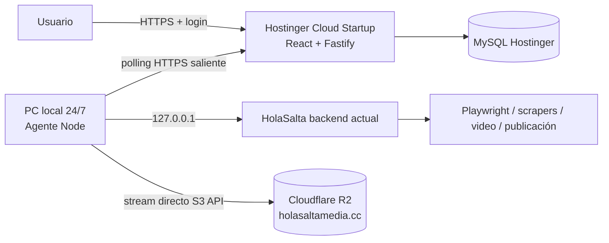

# HolaSalta Ops

Panel operativo remoto para `https://ops.holasalta.com`. Hostinger ejecuta una aplicación Node.js liviana (interfaz, autenticación, MySQL y cola); la PC de HolaSalta ejecuta Playwright, scrapers, imágenes, videos y publicaciones mediante un agente local saliente.

## Resultado

- Acceso desde celular o computadora con email, contraseña, cookie segura, CSRF y TOTP opcional.
- Ningún puerto de la PC queda expuesto a Internet. El agente consulta Hostinger por HTTPS cada 5 segundos.
- Hostinger no procesa imágenes/videos, no ejecuta navegadores y no recibe credenciales de WordPress, R2 o redes.
- Los videos se transmiten desde la API local directamente a Cloudflare R2 y quedan descargables desde `holasaltamedia.cc`.
- MySQL conserva comandos, estados, auditoría y snapshots. Una caída eléctrica no pierde la cola.
- Publicaciones con posible efecto externo no se reintentan automáticamente si el resultado quedó incierto.

## Arquitectura



La explicación completa está en [docs/ARCHITECTURE.md](docs/ARCHITECTURE.md).

## Estructura

- `apps/web`: SPA React responsive.
- `apps/server`: API Fastify, autenticación, MySQL, auditoría y broker de comandos.
- `apps/agent`: worker para Windows y adaptadores de la API local.
- `packages/contracts`: esquemas Zod compartidos y catálogo de comandos.
- `scripts`: credenciales, supervisor, tarea programada y diagnóstico.
- `tests`: seguridad, validación, idempotencia, concurrencia y recuperación.
- `docs`: despliegue, operación, seguridad y plan end-to-end.

## Desarrollo local

Requiere Node.js 22.

```powershell
npm.cmd ci
npm.cmd run typecheck
npm.cmd test
npm.cmd run build
```

Para una demo sin MySQL:

```powershell
$env:NODE_ENV="development"
$env:OPS_STORAGE_DRIVER="memory"
$env:OPS_BOOTSTRAP_ADMIN_PASSWORD_HASH=""
npm.cmd run dev:server
```

El modo `memory` está prohibido automáticamente cuando `NODE_ENV=production`.

## Instalación real resumida

1. Crear MySQL en Hostinger.
2. Abrir `D:\Ops\.secrets\hostinger.env`, reemplazar sólo los tres valores `DB_*` y cargarlo en hPanel.
3. Desplegar el repositorio como Node.js 22 con `npm ci && npm run build` y entrada `dist/server/main.js`.
4. Conectar `ops.holasalta.com` y esperar SSL.
5. En la PC ejecutar `powershell -ExecutionPolicy Bypass -File D:\Ops\scripts\install-agent-task.ps1`.
6. Ejecutar `powershell -ExecutionPolicy Bypass -File D:\Ops\scripts\doctor.ps1`.
7. Abrir `D:\Ops\.secrets\ADMIN_CREDENTIALS.txt`, ingresar y activar TOTP en Seguridad.

El procedimiento exacto, validaciones y rollback están en [docs/DEPLOY_HOSTINGER.md](docs/DEPLOY_HOSTINGER.md).

## Uso diario

- `Resumen`: estado de PC, runtime, trabajos activos y alertas.
- `Scrapers`: titulares por fuente/todas y procesamiento de URLs deduplicadas.
- `Noticias`: carga, edición, guardado y publicación multicanal.
- `Automatización`: start/stop/restart, jobs y pendientes de Instagram.
- `Videos`: procesamiento por URL/lote, publicación y exportación directa a R2.
- Los grupos de WhatsApp se eligen dentro de cada publicación y los posts de WordPress se administran desde `Noticias`.
- `Comandos`: progreso, resultado, errores, cancelación y reintento manual.
- `Auditoría`: accesos y mutaciones administrativas.
- `Seguridad`: activación de TOTP.

Si el agente aparece desconectado, los comandos quedan `queued`. Si una publicación pierde conexión después de comenzar, queda `requires_attention`: verificar primero en la red destino y sólo después decidir si reintentar.

## Comandos de mantenimiento

```powershell
npm.cmd run typecheck
npm.cmd run lint
npm.cmd test
npm.cmd run build
powershell -ExecutionPolicy Bypass -File .\scripts\doctor.ps1
```

No subir `.secrets`, `.env`, `agent-state`, logs, cookies ni perfiles de navegador. `.gitignore` los excluye.

## Documentación

- [Plan end-to-end](docs/PLAN_END_TO_END.md)
- [Deploy en Hostinger](docs/DEPLOY_HOSTINGER.md)
- [Runbook del agente local](docs/LOCAL_AGENT_RUNBOOK.md)
- [Seguridad y recuperación](docs/SECURITY_AND_RECOVERY.md)
- [Catálogo de comandos](docs/COMMAND_CATALOG.md)
